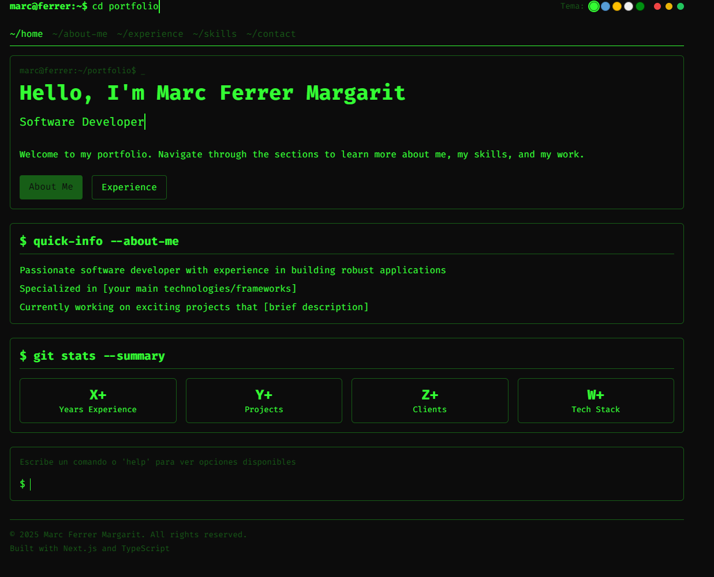

# Terminal Portfolio

A developer portfolio website with a terminal-inspired interface. This project combines the aesthetic of a command-line terminal with the usability of a modern web application.



## Features

- 🖥️ Terminal-inspired design with customizable color themes
- 🔤 Interactive command line interface for navigation
- 🧭 Conventional navigation links for non-technical visitors
- 📱 Fully responsive layout for all devices
- 🎨 Multiple terminal color themes (Green, Blue, Amber, White, Matrix)
- ⌨️ Command history with arrow key navigation

## Tech Stack

- [Next.js](https://nextjs.org/) - React framework
- [TypeScript](https://www.typescriptlang.org/) - Type-safe JavaScript
- [Tailwind CSS](https://tailwindcss.com/) - Utility-first CSS framework

## Getting Started

### Prerequisites

- Node.js (v18.0.0 or higher)
- npm (v8.0.0 or higher)

### Installation

1. Clone the repository
   ```bash
   git clone https://github.com/yourusername/terminal-portfolio.git
   cd terminal-portfolio
   ```

2. Install dependencies
   ```bash
   npm install
   ```

3. Run the development server
   ```bash
   npm run dev
   ```

4. Open [http://localhost:3000](http://localhost:3000) in your browser to see the result.

## Project Structure

```
src/
├── app/               # Next.js App Router pages
├── components/        # React components
│   ├── layout/        # Layout components (Terminal)
│   ├── terminal/      # Terminal-specific components
│   └── theme/         # Theme toggle components
├── styles/            # Global CSS
```

## Usage

### Web Interface

Navigate through the portfolio using the conventional navigation links at the top of the page.

### Terminal Commands

The terminal accepts the following commands:

- `help` - Show available commands
- `cd [section]` - Navigate to a section (e.g., `cd about`)
- `goto [section]` - Alias for cd
- `open [section]` - Alias for cd
- `about` - Go to the About Me page
- `experience` - Go to the Experience page
- `skills` - Go to the Skills page
- `contact` - Go to the Contact page
- `home` - Go to the Home page
- `clear` - Clear the terminal
- `theme [name]` - Change the color theme (options: green, blue, amber, white, matrix)

## Customization

### Content

Edit the page files in `src/app/` to update the content of each section.

### Themes

Modify the theme colors in `src/components/theme/ThemeToggle.tsx` to customize the appearance.

## Deployment

This portfolio is designed to be deployed on any hosting service that supports Next.js applications. Here are some recommended options:

### Vercel (Recommended)

```bash
npm install -g vercel
vercel
```

### Netlify

```bash
npm install -g netlify-cli
netlify deploy
```

### Static Export

```bash
npm run build
npm run export
```

This will generate a static version of the site in the `out` directory that can be deployed to any static hosting service.

## License

This project is licensed under the MIT License - see the LICENSE file for details.

## Acknowledgements

- Font used: [Fira Code](https://github.com/tonsky/FiraCode)
- Terminal inspiration from classic command-line interfaces
